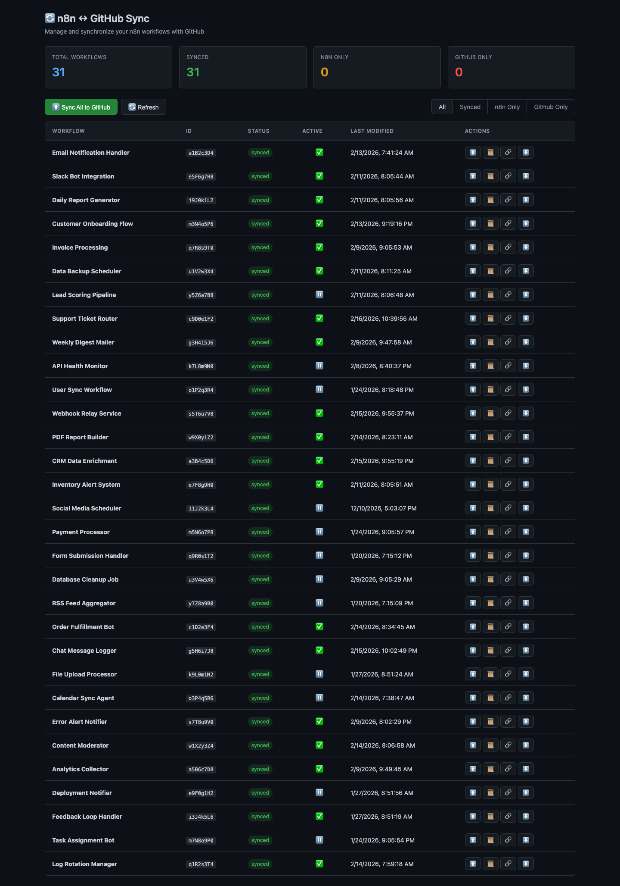
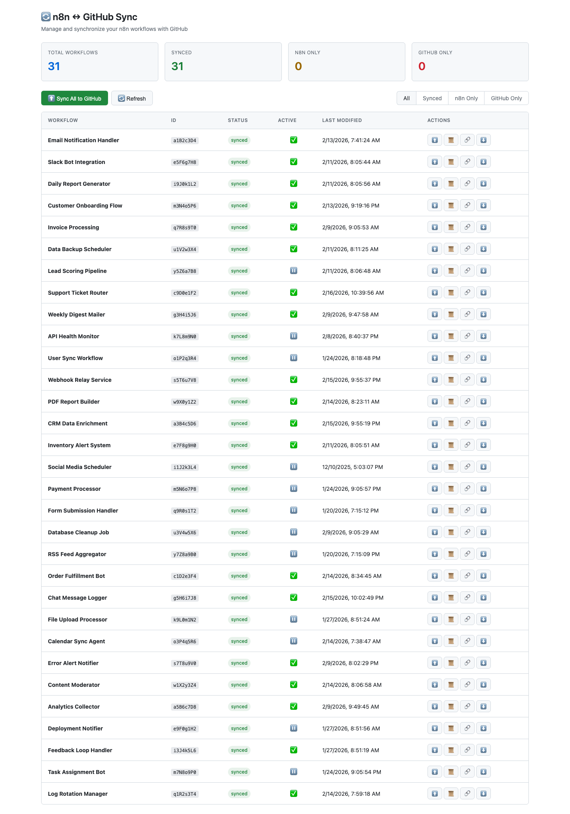
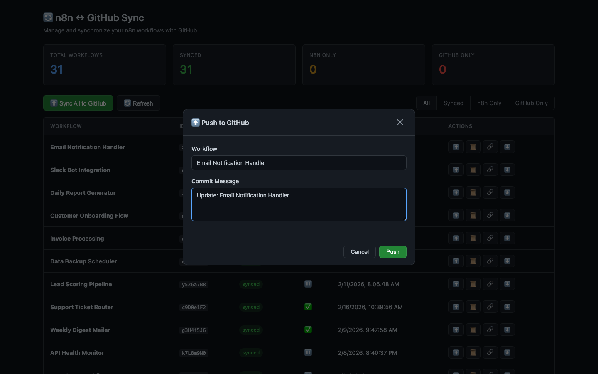

# n8n GitHub Sync + Dashboard

A self-hosted n8n workflow that syncs all your workflows to a GitHub repository — with a built-in web dashboard, commit history, restore functionality, and automatic daily backups.


## Screenshots

### Dark Mode


### Light Mode


### Push to GitHub


## Features

- **Web Dashboard** — Clean UI to manage all your workflow syncs, served directly from a webhook. Automatically follows your system light/dark mode preference.
- **Push to GitHub** — Push individual workflows or sync all at once, with custom commit messages.
- **Smart Scheduled Sync** — Automatic daily backup that only pushes workflows that have actually changed. Commit messages describe exactly what changed (added/removed/modified nodes, connection updates, etc.).
- **Commit History** — Browse the full Git history of any synced workflow.
- **Restore from GitHub** — Restore any workflow from GitHub, either as a new workflow or by replacing an existing one. Supports restoring from any previous commit.
- **Single Config Node** — All credentials stored once in workflow static data. No duplication across nodes.
- **Zero Dependencies** — Pure n8n workflow, no external services needed beyond n8n and GitHub.

## Quick Start

### Option 1: Import the JSON directly

1. Download `n8n-github-sync-workflow.json`
2. In n8n, go to **Workflows > Import from File**
3. Open the **Save Config** node and fill in your credentials
4. Click **Test step** on the Save Config node to persist the config
5. **Activate** the workflow
6. Open `https://your-n8n.com/webhook/github-sync` in a **new browser tab**

### Option 2: Use the generator (pre-configured)

1. Clone this repo
2. Copy the example env file and fill in your values:
   ```bash
   cp .env.example .env
   ```
3. Edit `.env` with your credentials
4. Generate the workflow:
   ```bash
   node generate-workflow.js
   ```
5. Import the generated `n8n-github-sync-workflow.json` into n8n
6. **Activate** the workflow
7. Open `https://your-n8n.com/webhook/github-sync` in a **new browser tab**

## Configuration

| Variable | Description |
|---|---|
| `GITHUB_OWNER` | Your GitHub username or org |
| `GITHUB_REPO` | Repository name for backups |
| `GITHUB_BRANCH` | Branch to sync to (e.g. `main`) |
| `GITHUB_TOKEN` | GitHub Personal Access Token with `repo` scope |
| `N8N_BASE_URL` | Your n8n instance URL (e.g. `http://localhost:5678`) |
| `N8N_API_KEY` | n8n API key (Settings > API) |
| `BASE_PATH` | Folder path in the repo (default: `workflows`) |

## API Endpoints

Once the workflow is active, these endpoints are available:

| Method | Path | Description |
|---|---|---|
| `GET` | `/webhook/github-sync` | Web dashboard |
| `GET` | `/webhook/github-sync/api/status` | List all workflows with sync status |
| `POST` | `/webhook/github-sync/api/sync-all` | Push all workflows to GitHub |
| `POST` | `/webhook/github-sync/api/sync-single` | Push a single workflow (`{ "workflow_id": "...", "commit_message": "..." }`) |
| `POST` | `/webhook/github-sync/api/history` | Get commit history (`{ "github_path": "..." }`) |
| `POST` | `/webhook/github-sync/api/restore` | Restore from GitHub (`{ "github_path": "...", "mode": "new" or "replace" }`) |

## How It Works

- All HTTP requests inside n8n Code nodes use `helpers.httpRequest()` (compatible with all n8n versions)
- The dashboard HTML is base64-encoded inside the workflow to avoid string escaping issues
- Configuration is stored in `$getWorkflowStaticData('global')` — set once, shared across all nodes
- The scheduled sync compares `updatedAt` timestamps to skip unchanged workflows
- Changed workflows get descriptive commit messages like: `Update My Workflow: Modified: HTTP Request, Code Node | Added: Filter | Connections updated`

## Requirements

- n8n (self-hosted, any version)
- GitHub account with a repository for backups
- GitHub Personal Access Token with `repo` scope
- n8n API key

## License

MIT
